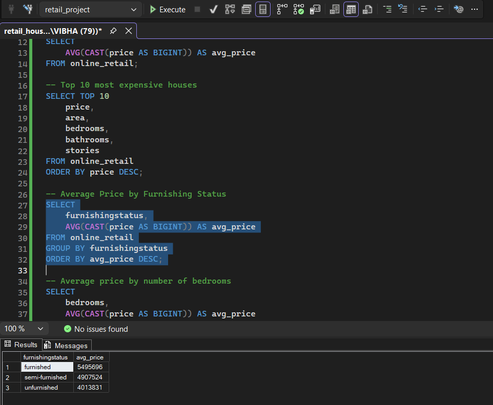

# House Price SQL Analysis

## Overview
This project analyzes a housing dataset using SQL Server to explore house prices, property features, and customer insights.

## Tools Used
- SQL Server
- SSMS

## SQL Concepts Used
- SELECT
- WHERE
- GROUP BY
- ORDER BY
- SUM()
- AVG()
- COUNT()
- CASE Statements
- CAST()
- ROUND()

## Analysis Performed
- Total revenue calculation
- Average house price
- Top 10 expensive houses
- Price comparison by furnishing status
- Bedroom-wise price analysis
- Houses with air conditioning
- Parking analysis
- Largest houses by area
- Main road and basement price comparison

## Key Insights
- Furnished houses have a higher average price compared to semi-furnished and unfurnished houses.
  
  
  
- Fully furnished houses have the highest average area compared to semi-firsnished and unfurnished.
  
  ![avg area by furnishing] (Screenshots/avg_area_by_furnishing.png)
  
- Main road access increases property value.
